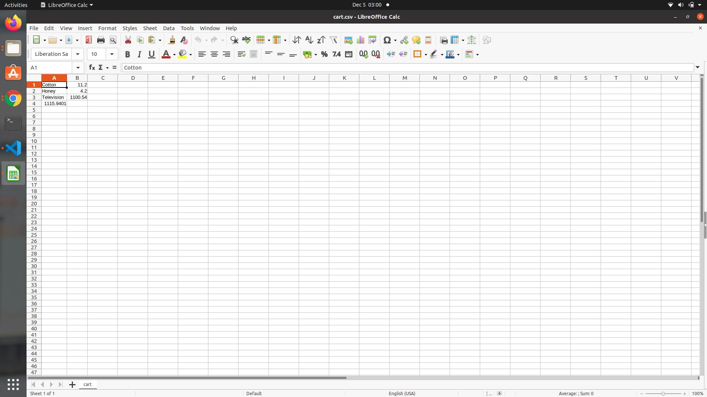

->Store the inventory , input and cardnumber.csv in same file of this project and enter the address int calling methods in the mainClass.java file

->Used Composite Desgin pattern for the code

Cards csv input 1:

Cards csv input 2:

Cards csv input 3:

Results for input 1:

Results for input 2:

Results for input 3:

Class Diagram:

